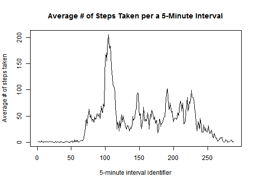
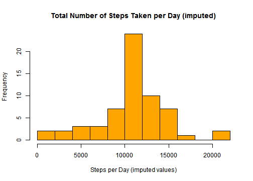

Repreducible Research Course - Peer Assessment Project 1
========================================================

Before you load and process the data please make sure that you set your working directory. 

## Loading and preprocessing the data

- Make sure you download the zip file in the preferred working directory.


```r
fileUrl <- "http://d396qusza40orc.cloudfront.net/repdata%2Fdata%2Factivity.zip"
download.file(fileUrl,destfile="./Activity monitoring data.zip") 
```

```
## Warning: unable to resolve 'd396qusza40orc.cloudfront.net'
```

```
## Error: cannot open URL
## 'http://d396qusza40orc.cloudfront.net/repdata%2Fdata%2Factivity.zip'
```

```r
list.files()
```

```
##  [1] "Activity monitoring data.zip"                
##  [2] "activity.csv"                                
##  [3] "code.R"                                      
##  [4] "figure"                                      
##  [5] "instructions.pdf"                            
##  [6] "PA1_template.html"                           
##  [7] "PA1_template.md"                             
##  [8] "PA1_template.Rmd"                            
##  [9] "repdata-data-activity.zip"                   
## [10] "Reproducible Research _Project 1 Outline.pdf"
```

- Unzip it and read the csv file into a dataset called "activity". Check the number of observations and the variables' class.


```r
unzip("./Activity monitoring data.zip")
```

```
## Warning: error 1 in extracting from zip file
```

```r
activity <- read.csv("activity.csv")
str(activity)
```

```
## 'data.frame':	17568 obs. of  3 variables:
##  $ steps   : int  NA NA NA NA NA NA NA NA NA NA ...
##  $ date    : Factor w/ 61 levels "2012-10-01","2012-10-02",..: 1 1 1 1 1 1 1 1 1 1 ...
##  $ interval: int  0 5 10 15 20 25 30 35 40 45 ...
```

Convert the date variable in a object of class "Date" and the interval variable into a factor one. Calculate the total number of step taken in each day (ignoring the NA values for now) and save it into a new variable called steps_day.


```r
activity$date <- as.Date(activity$date)
activity$interval <- as.factor(activity$interval)
steps_day <-tapply(activity$steps,activity$date,sum)
```

## What is mean total number of steps taken per day?

Summarize the new variable steps_day (calculated without removing the NA values) and check out the histogram of its values' distribution.


```r
summary(steps_day, digits=9)
```

```
##    Min. 1st Qu.  Median    Mean 3rd Qu.    Max.    NA's 
##      41    8841   10765   10766   13294   21194       8
```

```r
hist(steps_day, main="Total Number of Steps Taken per Day", col="light blue", xlab="Steps per Day")
```

 

Or for more precise results:


```r
mean(steps_day,na.rm=T)
```

```
## [1] 10766
```

```r
median(steps_day,na.rm=T)
```

```
## [1] 10765
```


## What is the average daily activity pattern?

Calculate the number of steps taken per 5-minute interval averaged across days (making sure the NA values are removed).


```r
steps_interval <-tapply(activity$steps,activity$interval,mean, na.rm=T)
```

Here is the time series plot.

```r
plot(steps_interval, type="l", main="Average # of Steps Taken per a 5-Minute Interval", xlab="5-minute interval identifier", ylab="Average # of steps taken")
```

 


```r
int <- which.max(steps_interval)
max_time <-paste(0,attr(int, "names"),sep="")
attr(int,"names") <- ""
max_steps<-int
```

On average the maximum number of steps occurred in the 104th 5-minute interval or within 5 minutes after 0835.

## Imputing missing values


```r
total_NA <- sum(is.na(activity))
```
- The total number of missing values is 2304.

- Let's fill in the missing values for the variable steps by using its mean estimate for that 5-minute interval across all days. 

- A new dataset activity2 is created by the following steps:
  1. Copy the dataset and check how many Na values there are.
  2. Calculate the mean values of the steps for all the 288 intervals across all days. 
  3. Create a loop that will replace in all missing values with their mean estimates.
  4. Make sure the new dataset has no more missing values.
 

```r
activity2 <- activity
summary(activity2)
```

```
##      steps            date               interval    
##  Min.   :  0.0   Min.   :2012-10-01   0      :   61  
##  1st Qu.:  0.0   1st Qu.:2012-10-16   5      :   61  
##  Median :  0.0   Median :2012-10-31   10     :   61  
##  Mean   : 37.4   Mean   :2012-10-31   15     :   61  
##  3rd Qu.: 12.0   3rd Qu.:2012-11-15   20     :   61  
##  Max.   :806.0   Max.   :2012-11-30   25     :   61  
##  NA's   :2304                         (Other):17202
```

```r
interval_means <- tapply(activity$steps,activity$interval, mean, na.rm=T)
summary(interval_means)
```

```
##    Min. 1st Qu.  Median    Mean 3rd Qu.    Max. 
##    0.00    2.49   34.10   37.40   52.80  206.00
```

```r
str(interval_means)
```

```
##  num [1:288(1d)] 1.717 0.3396 0.1321 0.1509 0.0755 ...
##  - attr(*, "dimnames")=List of 1
##   ..$ : chr [1:288] "0" "5" "10" "15" ...
```

```r
for (i in 1:17568) 
  {if (is.na(activity2$steps[i])) 
      {activity2$steps[i] <- interval_means[as.numeric(activity2$interval[i])]
       }
   }

summary(activity2)
```

```
##      steps            date               interval    
##  Min.   :  0.0   Min.   :2012-10-01   0      :   61  
##  1st Qu.:  0.0   1st Qu.:2012-10-16   5      :   61  
##  Median :  0.0   Median :2012-10-31   10     :   61  
##  Mean   : 37.4   Mean   :2012-10-31   15     :   61  
##  3rd Qu.: 27.0   3rd Qu.:2012-11-15   20     :   61  
##  Max.   :806.0   Max.   :2012-11-30   25     :   61  
##                                       (Other):17202
```

- Calculate the total number of steps per day, report the mean and the median and displace the distribution using a histogram.


```r
steps_day2 <-tapply(activity2$steps,activity$date,sum)
summary(steps_day2)
```

```
##    Min. 1st Qu.  Median    Mean 3rd Qu.    Max. 
##      41    9820   10800   10800   12800   21200
```

```r
hist(steps_day2, main="Total Number of Steps Taken per Day (imputed)", col="orange", xlab="Steps per Day (imputed values")
```

 

- The estimates of the median and the mean of the total steps per day computed from the new dataset are the same as initially estimated. However, slightly different estimates are reported for the 1st and the 3rd quatiles of the distribution.

## Are there differences in activity patterns between weekdays and weekends?

- Create a new factor variable with two levels.

```r
activity2$dayofweek <- weekdays(activity2$date)
table(activity2$dayofweek)
```

```
## 
##    Friday    Monday  Saturday    Sunday  Thursday   Tuesday Wednesday 
##      2592      2592      2304      2304      2592      2592      2592
```

```r
activity2$dayofweek <- gsub("Monday|Tuesday|Wednesday|Thursday|Friday","weekday",activity2$dayofweek)
activity2$dayofweek <- gsub("Saturday|Sunday","weekend",activity2$dayofweek)

table(activity2$dayofweek)
```

```
## 
## weekday weekend 
##   12960    4608
```

```r
activity2$dayofweek <- factor(activity2$dayofweek, levels=c("weekend","weekday"))
```

- Make a time series plot for the number of steps per interval averaged across weekdays and weekends. 


```r
library(ggplot2)
g <- ggplot(activity2, aes(as.numeric(interval), steps))
g + geom_line(aes(color=dayofweek)) + facet_wrap(~ dayofweek,nrow=2,ncol=1) + labs(x="Interval",y="Number of steps")
```

 

